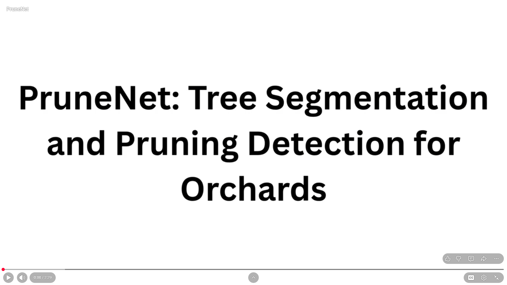

# PruneNet

An end-to-end UAV-based mango tree pruning decision support system using deep learning, pseudo-depth canopy analysis, geospatial localization, and autonomous path planning.

Authors : Nidugondi L N Sai Pranav, Dr. Sandeep Manjanna

# Abstract
Pruning trees plays a crucial role in maintaining canopy health, improving sunlight penetration, and maximizing orchard productivity. As precision agriculture continues to advance, there is a growing opportunity to complement traditional human expertise with intelligent, data-driven approaches that enable more consistent, efficient, and scalable pruning decisions. In this paper, we present PruneNet, an end-to-end computer vision framework that analyzes aerial imagery to identify trees that require pruning. The proposed pipeline starts with an instance-level tree canopy segmentation fine-tuned on custom built orchard dataset. Each segmented canopy is then analyzed using Intensity-Weighted Canopy Projection (IWCP), which estimates canopy transparency from RGB images by using the intensity variations as a structural proxy for the canopy density. Expert-in-the-loop calibration grounds transparency scores in agricultural expertise, producing pruning recommendations that are both explainable and practically actionable. Identified trees are subsequently georeferenced onto an orthomosaic of the orchard, and an optimized traversal path is generated to support efficient robotic inspection and intervention. Experimental evaluations demonstrate tree segmentation IoU of 86.53%, with 95.07% of the predicted masks exceeding IoU > 0.5, and reliable canopy transparency estimations with an accuracy of 86.67%. We also present empirical evaluations to illustrate the generalization across multiple orchard datasets,
highlighting the potential of PruneNet as a practical decision support pipeline for precision orchard management.

## Overview
PruneNet is an end-to-end precision agriculture framework designed for automated mango orchard analysis from UAV imagery.

The framework performs:

- Tree instance segmentation using Mask R-CNN
- Canopy transparency estimation using Intensity-Weighted Canopy Projection (IWCP)
- Automatic pruning recommendation
- Tree localization on an orthomosaic
- Voronoi-based navigation graph construction
- Elkai Traveling Salesman path optimization

Unlike existing approaches that stop at tree detection, PruneNet generates a complete pruning workflow from aerial imagery to an optimized traversal path for field workers or autonomous robots.

## Pipeline

## 🎥 Video Demonstration

